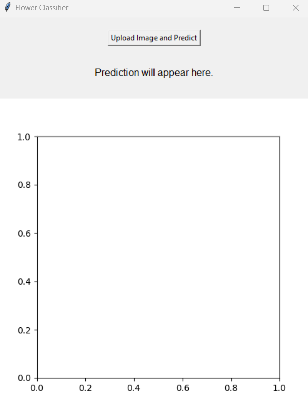
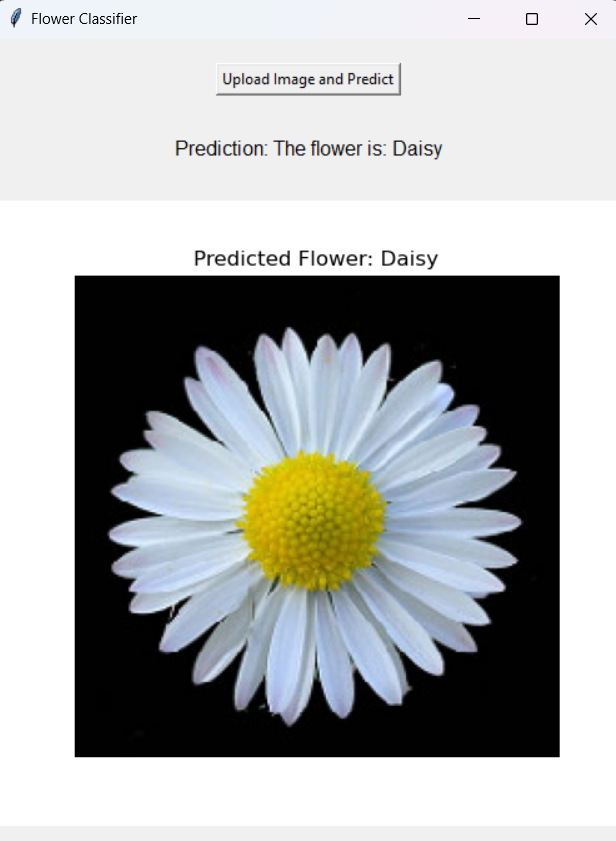

# Flora Classifier

Flora Classifier is a deep learning model built using Convolutional Neural Networks (CNN) to classify flower images into four categories: Daisy, Rose, Sunflower, and Tulip. The model uses TensorFlow and Keras for image preprocessing, data augmentation, and CNN model creation. It is capable of training on a dataset of flower images, saving the trained model, and making predictions on new images.

## Table of Contents
- [Installation](#installation)
- [Dataset](#dataset)
- [Usage](#usage)
- [Model Architecture](#model-architecture)
- [Training](#training)
- [Image Prediction](#image-prediction)
- [Results](#results)
- [API](#api)

## Installation

To run this project, you need to have Python installed along with the following libraries:

```bash
pip install tensorflow numpy pandas matplotlib pillow
```
Make sure you also have access to a dataset of flower images organized in separate folders for each class.

## Dataset
The dataset should be organized as follows:
```bash
Flowers_Group/
    daisy/
    rose/
    sunflower/
    tulip/
```
Where each folder contains images of the respective flower class.

## Usage
1. Clone the repository and navigate to the project folder.
2. Update the base_dir variable to the path where your dataset is stored.
3. Run the Python script to train the model on the dataset.
```bash
base_dir = r"C:\path\to\your\dataset"
```
## Model Architecture
The model consists of multiple convolutional layers for feature extraction followed by dense layers for classification. The architecture is as follows:
1. Convolutional Layers:
  - Conv2D with 64 filters, kernel size (5,5), followed by MaxPooling2D.
  - Additional Conv2D layers with 64 filters and kernel sizes (3,3), followed by MaxPooling2D.

2. Fully Connected Layers:
  - Flatten the feature maps from the convolutional layers.
  - Dense layer with 512 neurons and ReLU activation.

3. Output Layer:
  - Dense layer with 4 units (corresponding to the 4 classes) and softmax activation for classification.
## Training
The model is trained using the Adam optimizer and categorical cross-entropy loss function for 20 epochs. The dataset is split into training (80%) and validation (20%) sets.
```bash
model.fit(train_datagen, epochs=20, validation_data=test_datagen)
```
### Save and Load the Model
After training, the model is saved as an H5 file (Flora_Model.h5). You can load the saved model for future predictions:
```bash
model.save('Flora_Model.h5')
savedModel = load_model('Flora_Model.h5')
```
## Image Prediction
You can use the trained model to classify new flower images by providing an image path. The image is preprocessed and passed to the model to predict its class.
```bash
test_image = image.load_img('path_to_image', target_size=(224, 224))
test_image = image.img_to_array(test_image)
test_image = np.expand_dims(test_image, axis=0)
result = savedModel.predict(test_image)
```
The class with the highest predicted probability will be displayed:
```bash
predicted_class = np.argmax(result)
print("Predicted Flower:", list_[predicted_class])
```
## Results
The model is trained on the provided flower dataset and successfully predicts flower categories. For example, an image of a rose is predicted as:
```bash
Predicted Flower: Rose
```
## API
### Step 1: Upload the Image
In this step, you will upload the image of the flower you want to classify. The system allows you to select and upload an image, which is then processed by the model for prediction. Below is an example of the upload screen, where you can browse your local files and select an image:


### Step 2: View the Result
After the image is uploaded, the model will predict the flower type based on the image. The result will be displayed with the name of the flower. Below is an example of the result screen showing the model’s prediction:


In this case, the model successfully predicted that the uploaded image is a **Daisy**.

